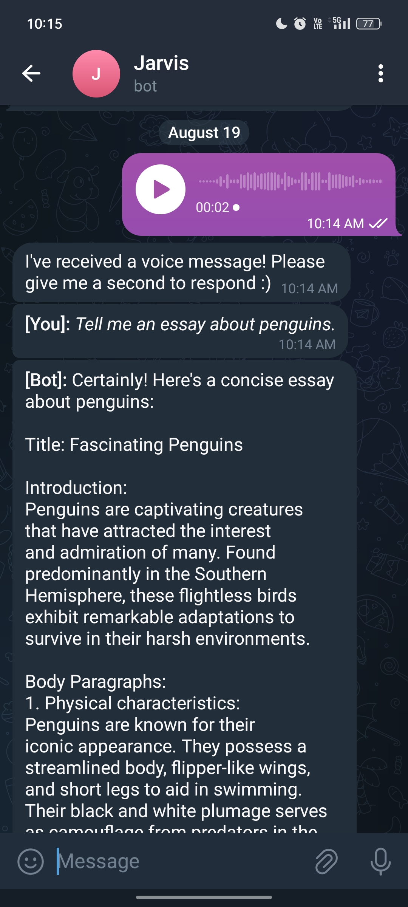

## Telegram Chatbot with OpenAI GPT-3.5 Turbo Integration
This repository contains the code for a Telegram chatbot that leverages the power of the OpenAI GPT-3.5 Turbo API to provide intelligent and dynamic conversations. With this chatbot, you can easily create conversational AI experiences on the Telegram platform. The bot is also able to recognise the voice input.
# Table of Contents
- Introduction
- Prerequisites
- Setup
- Usage
- Customization
# Introduction
This Telegram chatbot is powered by the OpenAI GPT-3.5 Turbo API, allowing it to engage in natural and context-aware conversations with users. It can be used for a variety of purposes, such as answering questions, providing information, or just for fun.
# Prerequisites
Before you can set up and use this Telegram chatbot, you will need the following:
- **Telegram Bot Token from BotFather**: You should have a Telegram bot token generated through the BotFather on Telegram. If you don't have one, follow [Telegram's official guide](https://core.telegram.org/bots#botfather) to create a bot and obtain the token.
- **OpenAI API Key**: You'll need an API key from OpenAI to access the GPT-3.5 Turbo API. You can sign up and get your API key from the [OpenAI platform](https://platform.openai.com/).
- **Python**: This project is written in Python, so you'll need a Python environment installed on your system.
# Setup
- Clone this repository to your local machine
- Navigate to the project directory using terminal
- Install the required Python packages using pip: "pip install -r requirements.txt"
- Add your Telegram bot token and OpenAI API key in main.py
- Run the main.py file on your machine

The chatbot is now up and running.
# Usage
Start a conversation with your Telegram bot by sending a message 

  
The chatbot will respond to your messages using the OpenAI GPT-3.5 Turbo API, generating context-aware and natural-sounding replies.You can customize and extend the chatbot's functionality by modifying the code in the main.py file or adding additional logic.

# Customization
You can customize the behavior and responses of the chatbot by editing the main.py file. Here are some customization options:
- **Custom Nature**: Determine the role you want your bot to play, whether it's grumpy or kind
- **Integration**: Integrate other APIs or services to enhance the bot's capabilities.
